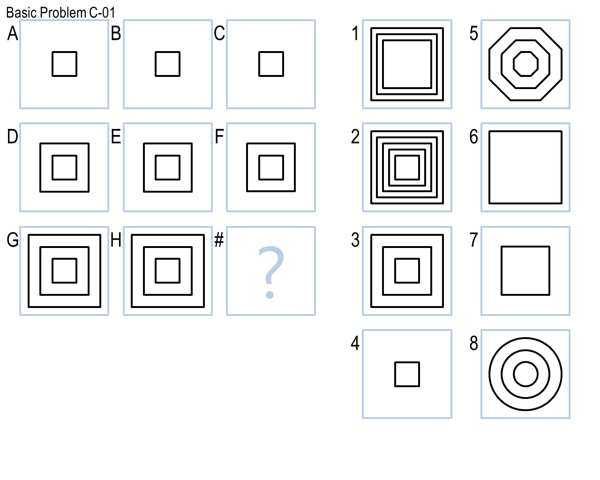
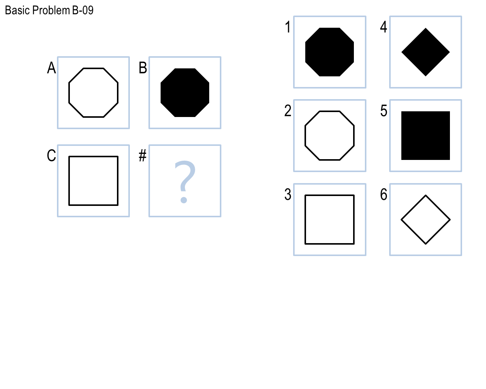
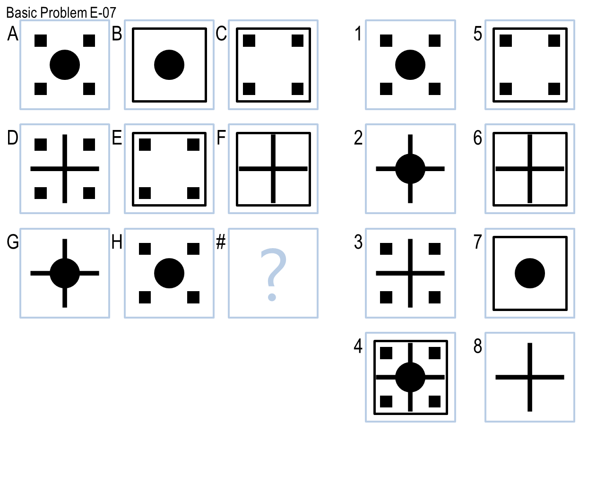

# Raven's Progressive Matrices IQ Agent
An AI agent that is able to solve problems from the popular IQ test, the [Raven's Progressive Matrices](https://en.wikipedia.org/wiki/Raven%27s_Progressive_Matrices). An example of a problem from this test is shown below:

In summary, the test is used to see if an agent can determine a "pattern" among the given images to decide on which of the candidate images is the correct answer.

## Project Acknowledgements
This project was done by Naum Markenzon for the CS-4635/7637-A Knowledge Based AI course at Georgia Tech taught by Ashok Goel, David Joyner, and Keith McGreggor.

## Problem Background
### Problem Organization
There are 4 general sets of problems the RPM Agent can answer from (B,C,D,E).

Additionally, each set has 2 variants, with each variant having 12 questions:
Variant 1. Basic Set B
Variant 2. Challenge Set B

Thus, there are a total of 96 problems the agent can be tested on.

### Problem Contents
For test sets B and C, the problems include verbal information (such as the shapes present in an image) and visual information (the images of the indiviudal figures in each problem). However, the problems in sets D and E contain purely visual information.

The problems themselves come in two variants, a 2x2 or a 3x3 variant. 

#### 2x2 Variant

For the 2x2 variant, there are 3 given images and the agent must determine the answer, which is among the 6 candidate images.

Example:

#### 3x3 Variant

For the 3x3 variant, there are 8 given images and the agent must determine the answer, which is among the 8 candidate images.

Example:

## Setup
Clone the repo using `git clone https://github.com/boomitsnoom/rpm_agent.git`

Ensure that Python is installed on your machine. If not, install the latest version of [Python](https://www.python.org/downloads/). It is also recommended to create a virtual environment when running the RPM agent. More details on creating a virtual enviroment can be found [here](https://docs.python-guide.org/dev/virtualenvs/).

Next, using a package manager such as pip/conda, install the required libraries by typing `pip install -r requirements.txt`

Congrats! Now you are able to run the RPM agent!

## Usage
### Running the Default Test Sets
In order to run the RPM agent with the default test sets, type `python RavensProject.py`
The results will be available in 2 files:
1. *SetResults.csv* (contains the set, # of incorrect,correct, and skipped answers)
2. *ProblemResults.csv* (contains a detailed list of each problem, displaying the correct answer and the agent's answer)

### Changing the Test Sets
If you would like to test the agent on other test sets, alter the file *ProblemSetList.txt* from within the *Problems* folder. By default, this folder only contains the basic problem sets from set D and E.

Additionally, each test set has its own folder with a unique *ProblemSetList.txt*.  By default, these unique txt files contain all 12 problems for that given set, but a subset of the problems can also be selected.

## Agent Design
The agent was designed as a purely visual agent that is prioritized to solve the very difficult set D and E problems. The agent uses the visual heuristics in order to determine which answer is the correct answer.

There are 3 visual heuristics employed:
1. Dark Pixel Ratio (Ratio of the fraction of dark pixels between the two images)
2. Dark Pixel Intersection Ratio (Ratio of dark pixels between the two images that are at the same x,y location)
3. Row XOR Image (A composite image which is the logical xor of 3 images)

The agent is composed of voting pairs (in the 2x2 and 3x3 variants) and voting trios (in the 3x3 variants). These voting pairs/trios are considerd "voters" and based on the results of the visual heuristics, the voters vote on the answer that is most similar to the heuristic. Once all voters have voted, the final answer is the winner of the "election", i.e. the winner is the answer with the most votes.

These 3 simple heuristics are sufficient to achieve over **70% accuracy** on the Basic sets D and E. Note that this agent is not optimized for the sets B and C, but these problems are more trivial and not as interesting as the problems within sets D and E.
